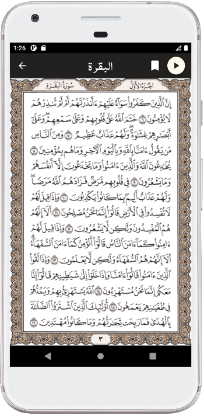

# Muslim-App

A new Flutter project.

## Features
- It Contains the whole quran to read.
- Also You can listen to quran by Sheikh Mashary Rashed El Afasi voice.
- Read Azkar (الصباح, المساء, النوم) , التسابيح , أدعية.
- Hadiths Of The Messenger Mohammed (صل الله عليه و سلم).
- Asmaa Allah El Hosna.
- Prayer Times.
 
 

| | ||
| - | - | - |
|  |  | 
|  |  | |
